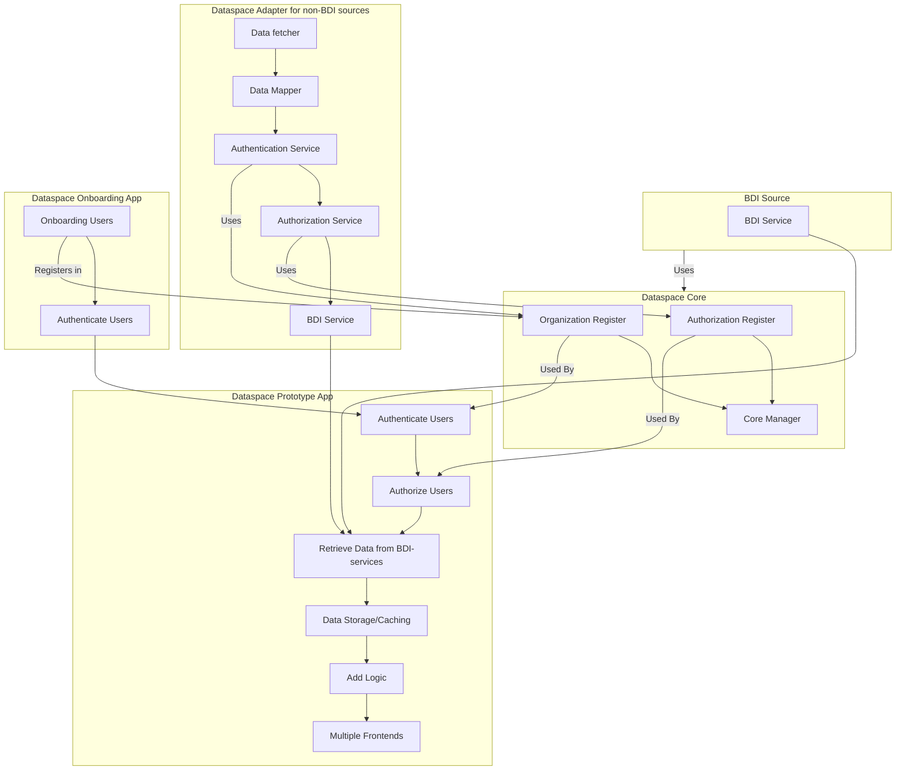

# Architecture

## Dataspace Adapter

### Objectives

1. Convert non-BDI data sources into RESTful APIs.
2. Map data to Dataspace Schema (DCSA, P4, etc.).
3. Implement iSHARE authentication based on the organization Register.
4. Other authentication mechanisms like API-key.
5. Policy Enforcement Point (PEP) based on the Authorization Register.
6. Support for events and Pub/Sub mechanisms.

### Components

1. **API Gateway**
   - Converts non-BDI data into RESTful services.
  
2. **Data Mapper**
   - Maps raw data to dataspace schema (DCSA, P4, etc.).

3. **Authentication Service**
   - Implements iSHARE authentication based on the organization Register.
   - Supports other authentication methods like API keys.

4. **Authorization Service**
   - PEP implementation based on the Authorization Register.

5. **Event Service**
   - Supports real-time events and Pub/Sub mechanisms.

### Deployment Options

1. Integrated within a monolithic application.
2. Docker Containers (Service and Common).
3. Azure Functions.
4. Low-code platforms.

### Considerations

1. The adapter should be easily convertible to a BDI source.

---

## Dataspace Core

### Components

1. **Organization Register**
    - Entails:
      - Organizations
      - EP Creation?
      - Trusted List?
    - Requirements:
      - iSHARE endpoints
      - REST
      - Independent database?
    
2. **Authorization Register (AuthRegister)**
    - Entails:
      - Permissions
      - Products and features
      - Organizations and users
    - Requirements:
      - iSHARE endpoints
      - REST
      - Independent database?
  
3. **Core Manager**
    - Web app for managing the Organization Register and Authorization Register.
    - IAA of the app?
    - Use of Keyper?
    - The Core manager also hosts a 'overview page' of available data sources and apps.

---

## Dataspace Apps

1. Retrieve data from REST sources (both non-BDI and BDI).
2. Authenticate users or machines.
3. PEP based on Authorization Register.
4. Data storage/caching.
5. Can add logic and combine sources.
6. Multiple frontends (chat, web app, email, etc.).

### Deployment Options

1. Integrated within a monolithic application with REST-like interfaces.
2. Separate backend system.
