# 10: NoodleBar Showcase
The NoodleBar Core Manager is a web application for managing the Organization Register and Authorization Register. This showcase displays the basics of the Core Manager. To keep things simple, this showcase functions using a local identity server.

### 10.1 Registering and logging in
When launching the Core Manager, the user is met with a welcome page. From here, the user can go to the login page. All other menu options are visible, but the user will automatically be directed to the login page if they are not authenticated.

If the user isn't registered yet, they can do so with an email address and password. If the registration is complete, the user can login using their credentials.
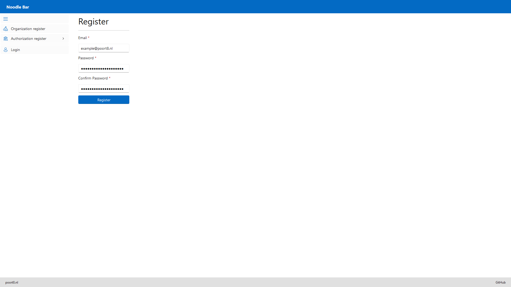

### 10.2 Organization Register
Within the Organization Register, the user can manage their organizations. They can add a new organization using the **New Organization** button.
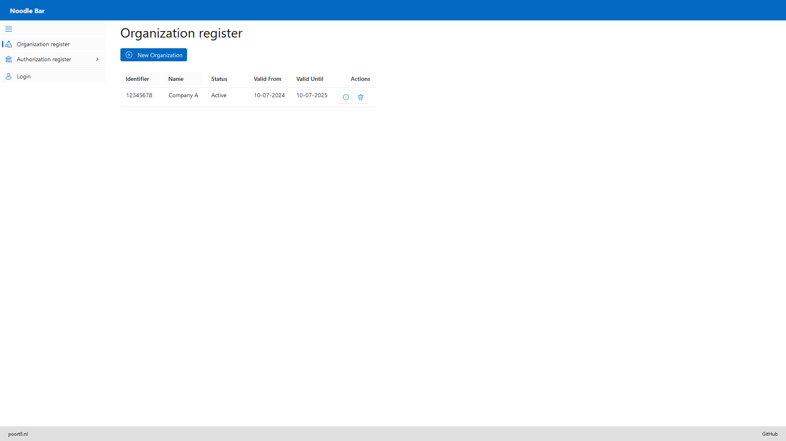
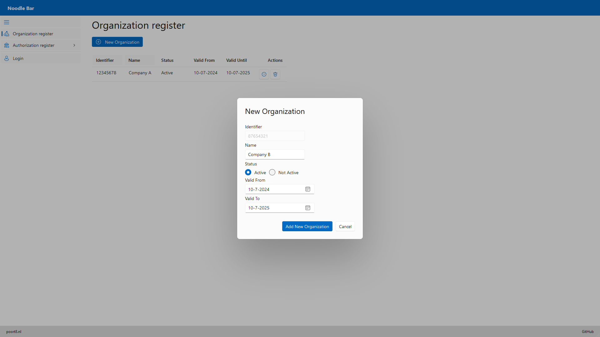

The user can delete an organization by clicking the delete button, or view additional details by clicking the **i** button.

### 10.3 Authorization Register
Within the Authorization Register, the user can manage their organizations mandates, resource groups, and policies.

#### 10.3.1 Organization mandates
The user can add an organization mandate using the **Add Organization** button. Each organization can only have one mandate, the *Add Organization* form contains a dropdown menu with available organizations from the Organization Register. This means that an organization mandate cannot be added if there are no organizations in the Organization Register. The user can delete an organization mandate by clicking the trash can button.
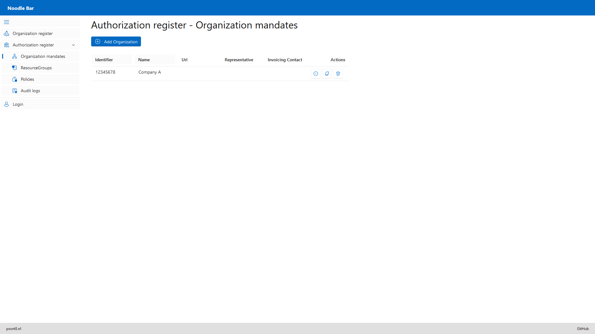
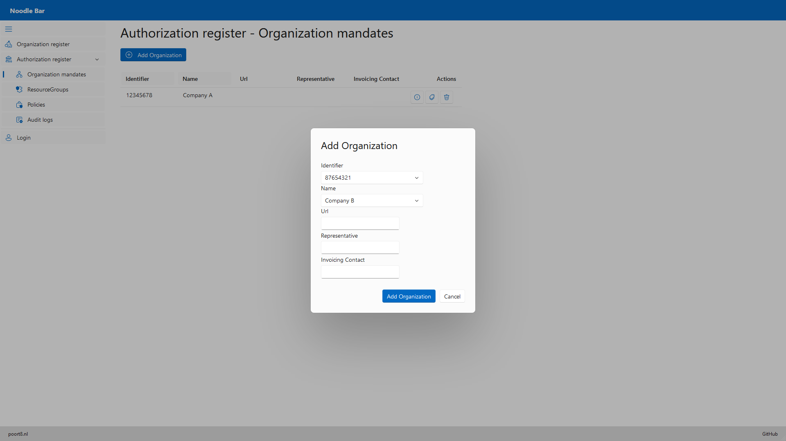

By clicking the label button, the user can manage named properties of an organization mandate.
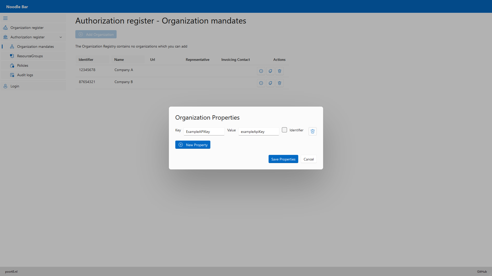

By clicking the **i** button, the user can view additional details of an organization mandate. From here, the user can manage employees of the organization mandate.
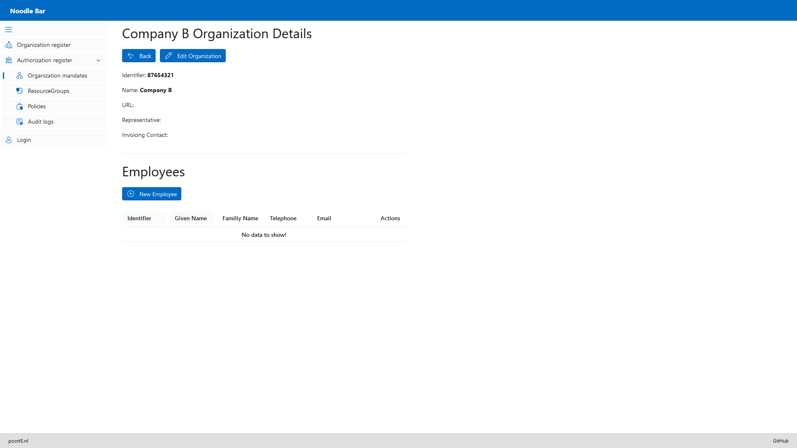
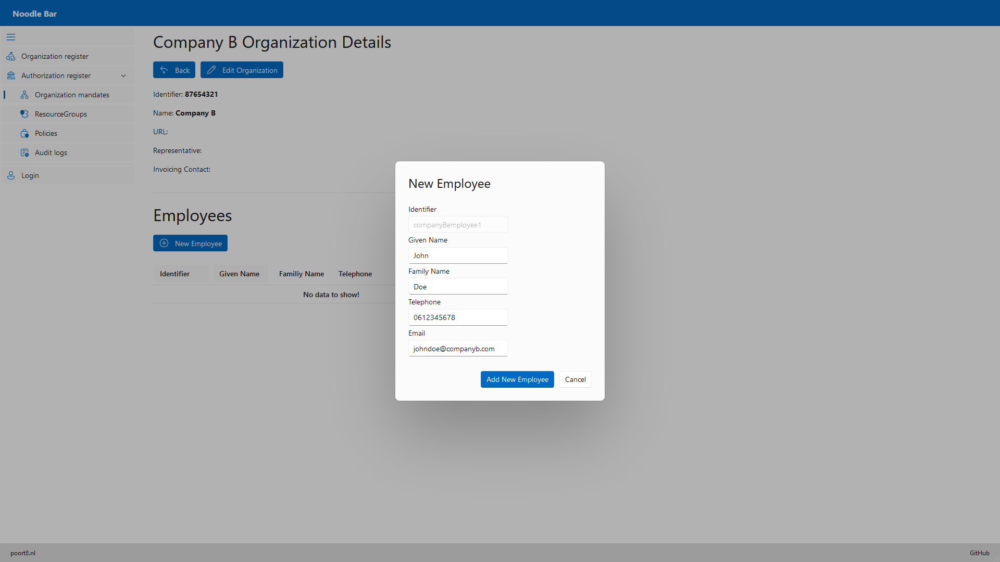

#### 10.3.2 Resource groups
The user can create a new resource group using the **New ResourceGroup** button. The *Provider* field in the *New ResourceGroup* form contains a dropdown menu with organizations from the Organization Register. This means that a resource group cannot be created if there are no organizations in the Organization Register. By clicking the label button, the user can manage named properties of a resource group. The user can delete a resource group by clicking the trash can button.
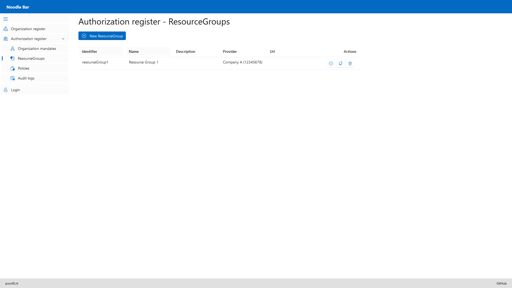
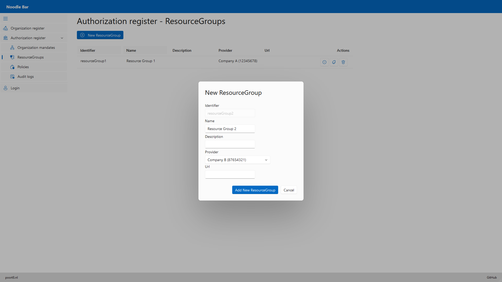

By clicking the **i** button, the user can view additional details of a resource group. From here, the user can manage resources of the resource group. Resources are not exclusive to a resource group, making it possible to add existing resources from one to another resource group.
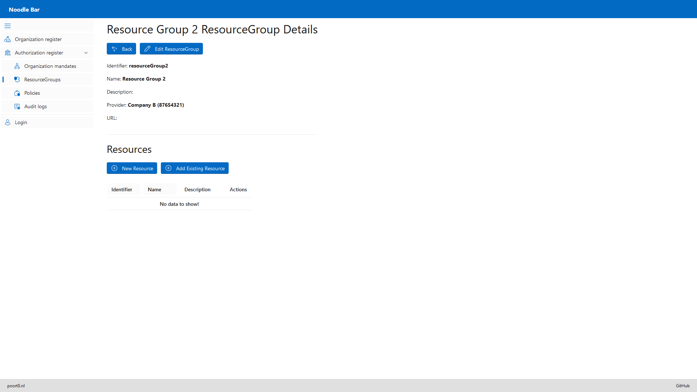
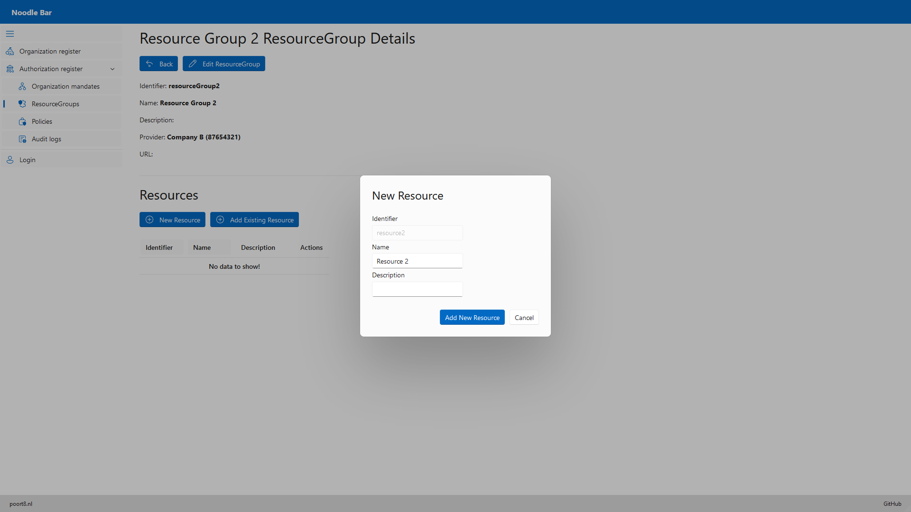

#### 10.3.3 Policies
The user can create a new policy using the **New Policy** button. The *Issuer*, *Actor*, and *Service Provider* fields in the *New Policy* form each contain a dropdown menu with organizations from the Organization Register. This means that a policy cannot be created if there are no organizations in the Organization Register. By clicking the label button, the user can manage named properties of a policy. The user can delete a policy by clicking the trash can button, or view additional details by clicking the **i** button.
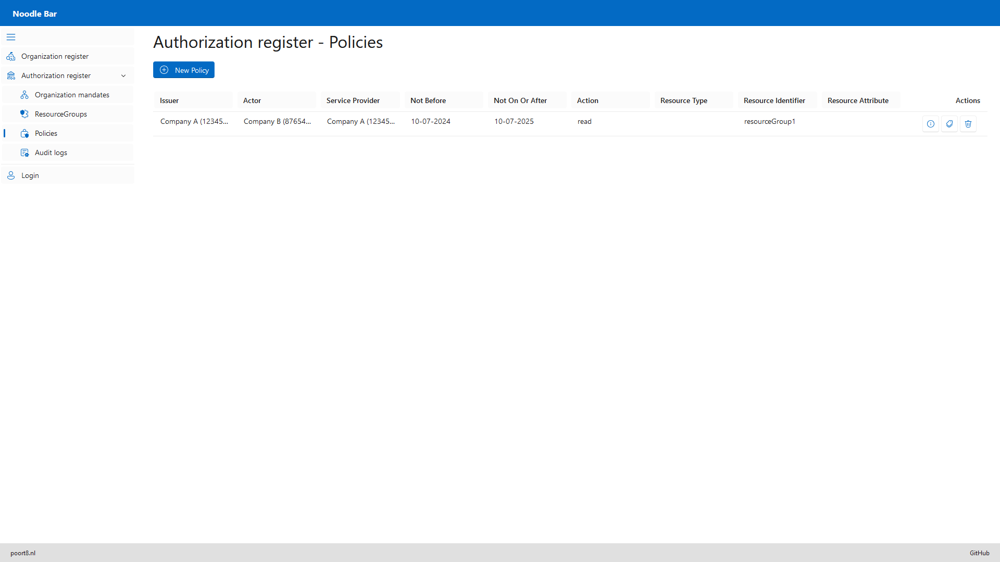
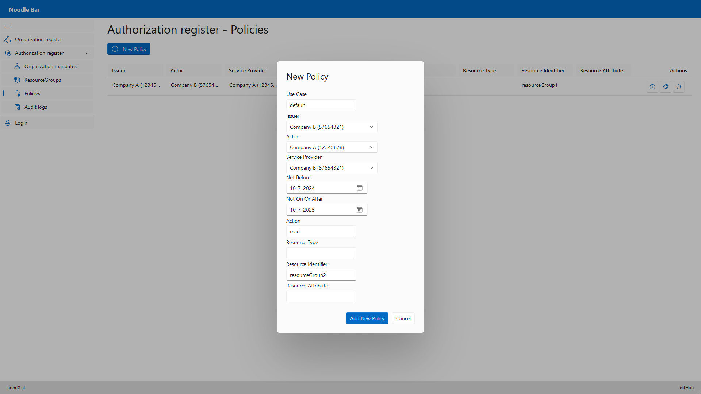