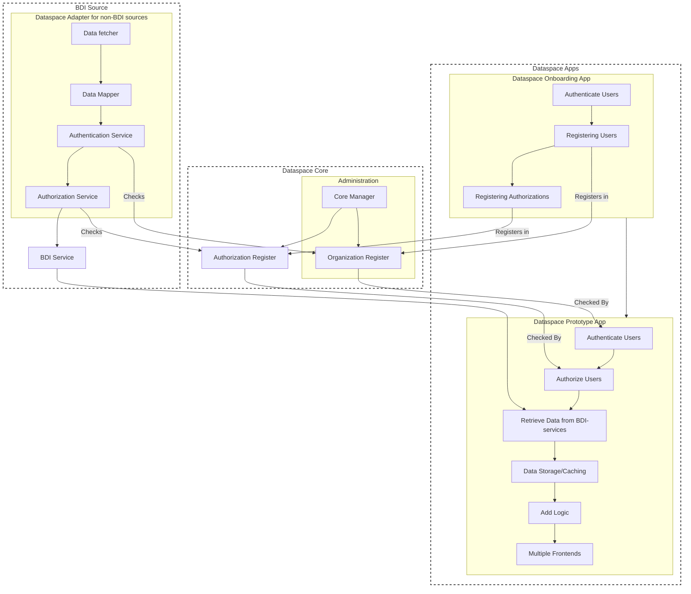

# 2: Dataspace Concepts

### 2.1 Dataspace Architecture

NoodleBar's architecture is designed to facilitate secure and efficient data sharing through the implementation of core dataspace principles. It supports interoperability, scalability, and compliance with the iSHARE Trust Framework.

#### Key Concepts:

1. **Data Providers (Sources)**: Data providers connect to the dataspace core for adherence, identification, authentication, and authorization. They supply data to other parties in the dataspace, ensuring it meets the required standards and protocols for secure sharing.

2. **Data Consumers**: Data consumers also connect to the dataspace core. Using the principles of the dataspace, they can access and retrieve data from the sources. This access is controlled and regulated to ensure data integrity and security.

3. **Organization Register**: This component acts as a central repository for managing organizational identities within the dataspace. It ensures that all participating entities are properly identified and authenticated.

4. **Authorization Register**: This register manages access control by defining and enforcing policies for data access. It ensures that only authorized entities can access specific data resources, maintaining data sovereignty and security.

### 2.2 Building Blocks of NoodleBar

NoodleBar offers a modular approach to setting up a dataspace, allowing for flexibility and integration with existing systems. The core building blocks include:

1. **Organization Register**: This component manages organizational identities within the dataspace, ensuring that all participating entities are properly identified and authenticated.

2. **Authorization Register**: This tool manages access permissions, ensuring that only authorized entities can access specific data resources.

3. **Dataspace Adapters**: These adapters make it possible for legacy APIs to connect to a dataspace. They ensure that data from non-BDI sources can be integrated into the dataspace by converting them into RESTful APIs and mapping the data to the dataspace schema.

4. **Dataspace (Prototype) Apps**: Applications that interact with the dataspace to retrieve data, authenticate users, enforce policies, and provide various user interfaces for data interaction. These prototype apps can be customized and extended as needed.

### 2.3 Deployment Models

NoodleBar provides different deployment models to suit various organizational needs. The key models are:

1. **Local Identity Server**: This is the most straightforward deployment, functioning as a standalone system. It is ideal for prototypes and a "dataspace in a day."

2. **OAuth Identity Server (recommended)**: This version supports federated capabilities using the OAuth standard. It allows for standalone operation while enabling integration with external systems, providing a flexible solution. The widespread adoption of OAuth also makes it highly scalable. There is extensive documentation available, numerous integration possibilities with third-party services, and the capability to be used in conjunction with federated identity providers.

3. **iSHARE**: Fully iSHARE-compliant, this deployment ensures the highest level of security. It uses X.509 certificates for authentication and iSHARE-compliant authorization mechanisms, making it suitable for organizations with stringent compliance requirements.

### 2.4 Roles in the iSHARE Trust Framework

The iSHARE Trust Framework consists of several roles that interact based on specific agreements. These roles include:

- **Service Consumer**: A legal entity that consumes a service provided by a Service Provider.
- **Service Provider**: A legal entity that provides a service for consumption by a Service Consumer.
- **Entitled Party**: A legal entity that holds the rights to a service provided by a Service Provider.
- **Identity Provider**: Provides identification and authentication services.
- **Identity Broker**: Facilitates connections between different Identity Providers and Service Providers.
- **Authorization Registry**: Manages storage and validation of delegation and authorization information.

These roles ensure that all parties involved in data sharing are properly authenticated, authorized, and compliant with the iSHARE terms of use.

### 2.5 Advantages of NoodleBar

- **Quick Deployment**: With the "dataspace in a day" capability, NoodleBar provides all the essential building blocks to get a dataspace up and running quickly.
- **Modularity**: The components can be customized and integrated with other systems, making it a flexible solution for various organizational needs.
- **Scalability**: NoodleBar is designed to scale, supporting growing data sharing needs as organizations expand.
- **Compliance**: Fully aligned with the iSHARE Trust Framework, NoodleBar ensures compliance with stringent data sharing standards.
- **Versatility**: NoodleBar supports various [deployment models](/4%20-%20NoodleBar%20Implementation%20Stages.md), from simple local [identity management](/6%20-%20Deployment%20Using%20a%20Local%20Identity%20Server.md) to advanced [OAuth (recommended)](/7%20-%20Deployment%20Using%20OAuth%20Server.md) and [iSHARE](/8%20-%20Deployment%20Using%20iSHARE.md) compliant setups.

### 2.6 Dataspace Adapters (In Development)

Dataspace Adapters play a critical role in integrating legacy systems into the dataspace. They ensure that data from non-BDI sources can be converted into a format compatible with the dataspace.

#### Key Objectives:

1. **Conversion to RESTful APIs**: Transform legacy data sources into RESTful services.
2. **Data Mapping**: Map raw data to the dataspace schema (e.g., DCSA, P4).
3. **iSHARE Authentication**: Implement authentication mechanisms based on the Organization Register.
4. **Policy Enforcement**: Enforce access control policies through the Authorization Register.
5. **Event and Pub/Sub Support**: Enable real-time data interaction through events and Pub/Sub mechanisms.

#### Key Components:

- **API Gateway**: Facilitates the conversion of legacy data into RESTful services.
- **Data Mapper**: Maps data to conform to dataspace standards.
- **Authentication Service**: Supports iSHARE and other authentication methods.
- **Authorization Service**: Enforces policies using the Authorization Register.
- **Event Service**: Manages real-time events and Pub/Sub operations.

### 2.7 Dataspace Apps (In Development)

Dataspace Apps provide interfaces and functionalities for interacting with the dataspace. They include tools for data retrieval, user authentication, and policy enforcement.

#### Key Features:

1. **Data Retrieval**: Access data from both BDI and non-BDI sources.
2. **User Authentication**: Authenticate users and machines.
3. **Policy Enforcement Point (PEP)**: Enforce authorization policies.
4. **Data Storage/Caching**: Store and cache data locally for efficient access.
5. **Logic Integration**: Add custom logic to data interactions.
6. **Multiple Frontends**: Support various user interfaces like web apps, chat interfaces, and email clients.

#### Deployment Options:

- Integrated within monolithic applications.
- As separate backend systems with REST interfaces.

### 2.8 Administrative Tools (In Development)

NoodleBar includes administrative tools to manage the dataspace efficiently.

#### Core Components:

- **Core Manager**: A web application for managing the Organization Register and Authorization Register.
- **Dashboard**: Provides an overview of data sources, applications, and usage statistics.
- **Self-Service Portals**: Allows organizations to manage their registrations and authorizations independently.

### 2.9 Disambiguation

In the developing realm of federated dataspace schemes, different—sometimes ambiguous—terminology is used. If possible, the Poort8 dataspace follows [schema.org](https://schema.org/) for terminologies and data models. For authorizations, Poort8 uses terminology in line with [casbin.org](https://casbin.org/). In the table below, we provide a non-exhaustive overview of how typical terminology is mapped to our Dataspace software.

| Poort8.Dataspace  | equivalent to ...                       |
|-------------------|-----------------------------------------|
| organisation      | party                                   |
| issuer            | entitledParty, data owner               |
| subject           | accessSubject, data consumer, data service consumer |
| provider          | service provider, data service provider |
| federated app     | application of a service provider       |
| product, service  | resourceType                            |
| features          | attributes                              |
| policy            | authorization, permission               |

### 2.10 Architectural Overview

